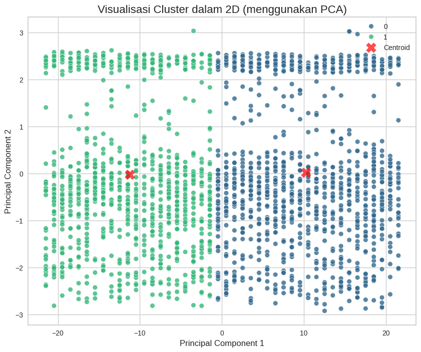
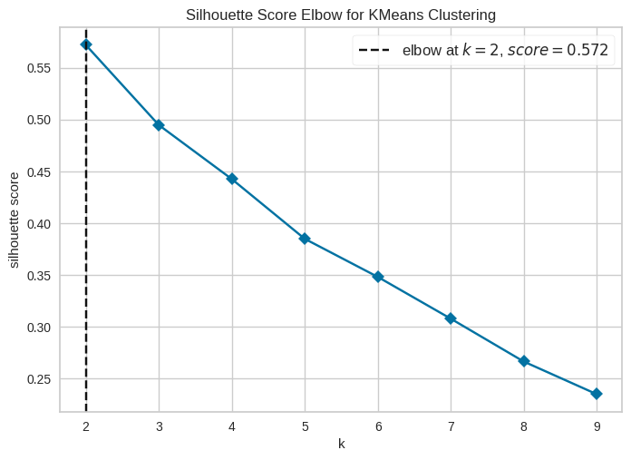

# machine-learning-clustering
End-to-end machine learning project featuring customer segmentation with K-Means Clustering and classification using Decision Tree.
# **Algorithms Used**
Exploratory Data Analysis (EDA)
Data Cleaning & Preprocessing
Label Encoding
K-Means Clustering
Elbow Method (Yellowbrick KElbowVisualizer)
Decision Tree Classification
# **Libraries**
Pandas
NumPy
Matplotlib
Seaborn
Scikit-learn
Yellowbrick
Joblib

## 📈 Cluster Visualization

## 📉 Elbow Method

